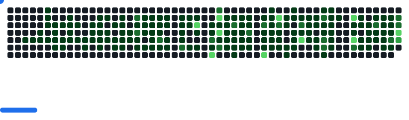

# Hi there 👋

I'm **Akinkunmi Afolabi** - GitHub Support Engineer passionate about helping developers succeed.

## 🚀 What I'm up to

- 🔧 Currently working on improving developer experiences and solving complex technical challenges
- 📚 Learning advanced migration strategies and enterprise support workflows
- 💡 Fun fact: I can help you troubleshoot GitHub Copilot, migrations, and pretty much anything GitHub-related!
- 🎯 All I'm saying is; sometimes, all the world needs is someone to solve their technical issues. So let's fix it! 😊

## 🛠️ Technologies & Tools

## 📊 GitHub Stats

## 📫 How to reach me

- GitHub: [@kunmi477](https://github.com/kunmi477)
- 💼 Catch me if you can

## 🌍 Fun Facts

- My favorite thing to automate is tedious manual processes
- I love clear blue skies and organized codebases
- Always ready to help fellow developers

---

⭐️ From [kunmi477](https://github.com/kunmi477)

<!--
**kunmi477/kunmi477** is a ✨ _special_ ✨ repository because its `README.md` (this file) appears on your GitHub profile.

Here are some ideas to get you started:

- 🔭 I'm currently working on ...
- 🌱 I'm currently learning ...
- 👯 I'm looking to collaborate on ...
- 🤔 I'm looking for help with ...
- 💬 Ask me about ...
- 📫 How to reach me: ...
- 😄 Pronouns: ...
- ⚡ Fun fact: ...
-->
